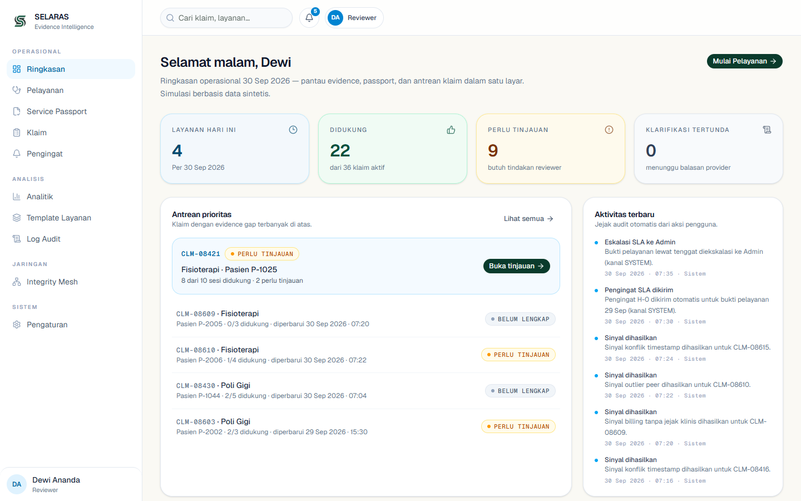
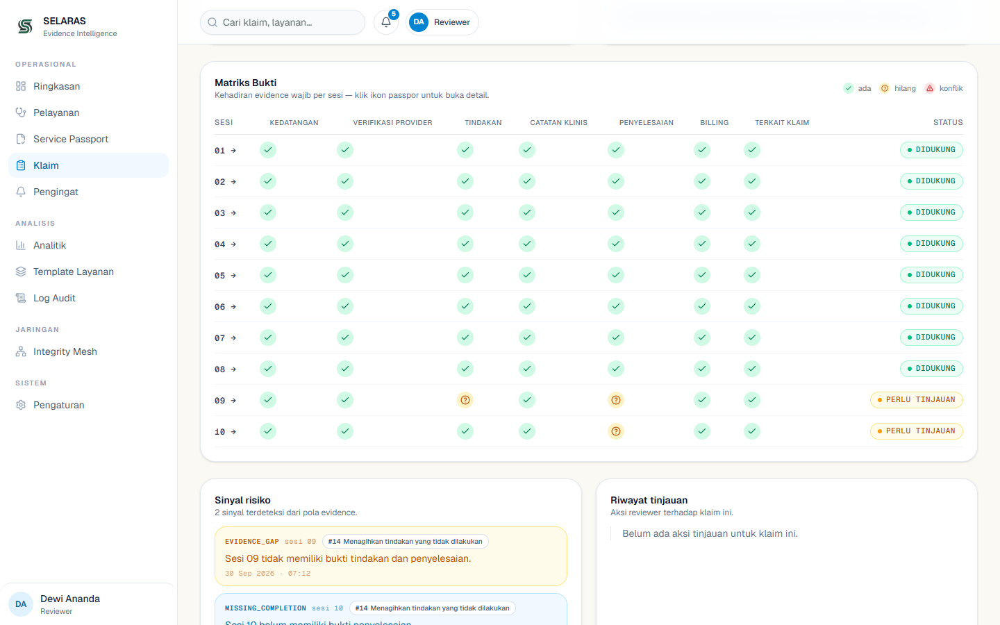

# SELARAS

**Sistem Evaluasi Layanan & Rekam Administrasi untuk Risiko Klaim** — lapisan integritas *evidence-first* untuk klaim fasilitas kesehatan dalam ekosistem JKN.

> *Detect Smarter, Protect JKN* · Prototipe untuk **Healthkathon 2026** · Kategori **Fasilitas Kesehatan → Phantom & Repeat Billing** · Tingkat kematangan: **Prototype** · Data **100% sintetis**

---

## Masalah

Di skala **284.514.113 peserta JKN** dan **23.812 FKTP** (BPJS Kesehatan, s.d. 31 Agustus 2026), setiap klaim berdiri di atas bukti pelayanan yang harusnya sudah terbentuk di titik layanan — tetapi bukti itu justru dicari **setelah** klaim masuk.

- Fraud faskes tercatat **Rp 6,8 triliun** (Jan–Okt 2025) — dua modus teratas: *phantom billing* & *manipulation diagnosis*, termasuk *repeat billing* (Kompas.id, 10 Des 2025).
- Temuan audit tim gabungan KPK–Kemenkes–BPJS–BPKP (Juli 2024): dari **4.341 kasus** klaim fisioterapi di 3 RS, hanya **1.072 (24,7%)** punya catatan rekam medis — **3.269 (75,3%) diduga fiktif, Rp 501,27 juta** (Kemenkes/KPK, 2024).
- Verifikasi yang ada (verifikasi awal, VPK, AAK) semuanya bekerja **reaktif — setelah bayar**.

**Akar masalahnya bukan niat, tapi arsitektur bukti:** informasi pelayanan tersebar di appointment, encounter, provider, treatment, catatan klinis, billing, dan klaim — ketika reviewer harus memverifikasi, cerita sudah tercecer.

Sumber lengkap: `docs/reference/SELARAS-Dokumentasi-Lengkap.pdf` (Bab 3 + Daftar Pustaka 14 sumber).

## Solusi

> **“Anda menjual bukti saat pelayanan terjadi.”** — SELARAS memindahkan pembentukan bukti ke *point of care*, sehingga ketika klaim datang, sistem tinggal **menyusun** buktinya, bukan **mencarinya**.

> **“Satu temuan. Menjadi perlindungan bersama.”** — Integrity Mesh: pola risiko yang tervalidasi di satu faskes melindungi seluruh jaringan, tanpa berbagi data pasien.

**Spine produk:** `PROVE → VERIFY → LEARN → PROTECT`

- **PROVE** — bukti dibentuk & ditandatangani di titik layanan (Service Anchor, Provider Attestation, Evidence Event) → Attested Service Passport.
- **VERIFY** — Claim Trace, Triangulation, Temporal Conformance, dan 7-dimensi Proof State menilai klaim terhadap bukti; jaringan menambahkan *step-up verification*.
- **LEARN** — hasil verifikasi menjadi feedback Risk Signature (Learning Loop) dengan rekomendasi tata kelola (GOOD / MONITOR / INSUFFICIENT).
- **PROTECT** — signature aktif → network match → kontrol adaptif; signature dipantau, diperbarui, atau dipensiunkan lewat governance.

**Alur bukti (9 langkah):**
`Service → Capture → Service Passport → Evidence Graph → Episode Reconstruction → Reconciliation → Gap/Conflict/Impact → AI Evidence Reasoner → Human Review`

**Prinsip produk:**
- **Evidence First** — bukti dibentuk saat pelayanan, bukan ditambang ulang setelah klaim.
- **Missing ≠ fraud** — bukti hilang = alasan untuk meninjau, bukan vonis kecurangan.
- **Explain Before Escalate** — AI menjelaskan “apa yang diketahui / hilang / didukung”, manusia memutuskan.
- **Human-in-the-Loop** — tanpa keputusan otomatis; semua override tercatat di audit log.



## Fitur

**Landing page (9 seksi):** Hero · Masalah · Cara Kerja · Service Passport · Golden Case · Penjelasan AI · Skala (Integrity Mesh) · Tata Kelola · CTA — dengan simulasi counterfaktual & graf bukti interaktif.

**Aplikasi (`/app`):**

| Modul | Yang bisa dilakukan |
|---|---|
| **Service Capture & QR point-of-care** | Mulai pelayanan → QR check-in (token HMAC-SHA256, 30 menit, sekali pakai) → catat 6 jenis bukti per sesi |
| **Service Passport** | Ringkasan otomatis satu episode: status kelengkapan bukti per sesi |
| **Proof Layer (Prove)** | Service Anchor + Provider Attestation → Evidence Events → **Proof State** 7 dimensi (REGISTERED → IDENTITY_BOUND → ATTESTED → CORROBORATED → SEALED, atau PROOF_GAP / INCONSISTENT), Triangulation, Temporal Conformance, Claim Trace, Provenance, Live Proof Stream, segel proof (evaluator lokal deterministik — tanpa KPI/keputusan otomatis) |
| **Reconciliation & Proof Gap Engine** | 6 pemeriksaan klaim ↔ bukti (kuantitas, temporal, identitas, kelengkapan, duplikasi, konflik) + sinyal risiko berpoin |
| **Claim Detail & Review** | Matriks 10 sesi × 6 bukti, dampak rupiah transparan, 4 aksi reviewer + catatan |
| **Replay** | Kronologi 70 langkah, bisa dijeda & diskip |
| **Evidence Graph** | Graf bukti 86 node / 113 rel dengan provenance (sumber, waktu, pencatat) |
| **AI Evidence Reasoner** | Penjelasan 5 blok *evidence-grounded* + Kopilot Klarifikasi (draf surat, reviewer yang finalkan) |
| **Integrity Mesh** | Registry Risk Signature, siklus USULAN→DISETUJUI→DIVALIDASI→AKTIF, match queue, step-up verification (4 kontrol → CLEARED / NEEDS_MORE_DATA / CONFIRMED) |
| **Learning Loop & Governance** | Feedback verifikasi → statistik match/verified/false-positive → rekomendasi GOOD / MONITOR / INSUFFICIENT (aturan tata kelola prototipe, tanpa ML/fraud classifier otomatis) → monitor (DIPANTAU), perbarui versi (v+1, DIPERBARUI), atau pensiunkan (TIDAK BERLAKU) dengan riwayat versi + snapshot match |
| **Analitik & Log Audit** | Metrik operasi/investigasi/bukti/AI + jejak permanen aktor-keputusan-waktu |
| **RBAC 4 peran** | `operator` · `provider` · `reviewer` · `admin` — admin sengaja **tidak** punya hak memutuskan klaim |



## Demo cepat

```bash
npm install
npm run dev        # → http://localhost:3000
```

Build terbaru juga live di **https://selaras-bice.vercel.app** (otomatis ter-deploy dari `main` lewat Vercel). Untuk demo dari kondisi bersih: hapus localStorage `selaras-app-v1` lalu reload — role default aplikasi adalah **Reviewer**, jadi ganti peran dulu di Pengaturan (`/app/settings`) sesuai langkah (Operator untuk memulai pelayanan, Provider untuk attestasi, Admin untuk publikasi jaringan).

Rute demo:
- `/` — landing page
- `/app` — dashboard reviewer
- `/app/claims/CLM-08421` — **golden case**: 10 sesi diklaim → 8 didukung bukti → 2 ditahan (Rp 2.800.000 lolos, Rp 700.000 antre tinjauan), skor 27 vs ambang gerbang 65
- `/app/proof/CLM-08421` — Proof View (proof state, 7 dimensi, stream, claim trace, provenance)
- `/app/claims/CLM-08421/replay` · `/graph` · `/ai` · `/impact` — replay, graf, penjelasan AI, dampak
- `/app/network` · `/network/signatures` · `/network/publish` · `/network/matches` — Integrity Mesh

### DEMO A — LOCAL PROOF (8 langkah, CLM-08421)

1. Buka `/app/claims/CLM-08421` — golden case, skor 27, 2 sesi tertahan.
2. Buka **Proof View** — Service Passport, **PROOF GAP** + alasan per sesi (Session 09–10).
3. **Replay** — kronologi 70 langkah.
4. **Graf bukti** — 86 node / 113 rel + provenance.
5. **AI Evidence Reasoner** — 5 blok penjelasan berbasis bukti.
6. **Impact** — dukungan bukti & dampak rupiah.
7. **Klarifikasi** — Kopilot Klarifikasi (draf surat, reviewer yang finalkan).
8. **Audit log** — jejak aktor-keputusan-waktu utuh.

### DEMO B — NETWORK (10 langkah, RS-017)

1. `/app/network` — RS-017 **DIVALIDASI**, match aktif **0**.
2. `/app/network/publish` — publikasikan RS-017 (butuh peran **Admin** via Pengaturan).
3. `/app/network` — RS-017 **AKTIF**, match jaringan **[CLM-08611]**.
4. `/app/network/matches` — match CLM-08611 aktif.
5. Buka **CLM-08611** — panel LOCAL/NETWORK/RECOMMENDED + **STEP-UP VERIFICATION**.
6. Mulai verifikasi — 4 kontrol (SERVICE_UNIQUENESS / PROVIDER_ATTESTATION / COMPLETION_EVIDENCE / BILLING_LINKAGE).
7. Centang 4/4 kontrol → submit hasil **CLEARED**.
8. Feedback tercatat — outcome **LOLOS** + audit NET_VERIFICATION_*.
9. `/app/network/signatures/RS-017` — **Learning Loop** terisi (matches/verified/false-positive rate) + **GOVERNANCE** (Pantau/Perbarui/Pensiunkan).
10. `/app/audit-log` — seluruh langkah jaringan tercatat.

### DEMO C — POINT-OF-CARE (10 langkah, dari layanan)

1. `/app/pelayanan` — role **Operator** (via Pengaturan) → isi form **Mulai pelayanan baru** → **Mulai Pelayanan →**; Evidence **Kedatangan** tercatat otomatis + audit `SERVICE_STARTED` / `IDENTITY_BOUND`.
2. Panel **Verifikasi sesi layanan** — 4 syarat wajib (Episode / Provider / Titik layanan / Timestamp) sebelum evidence bisa dicatat.
3. Role **Provider** → **MULAI & ATTEST SERVICE** → `SERVICE STARTED ✓` + audit `SERVICE_ATTESTED` (aktor manusia, bukan sistem).
4. **Konfirmasi titik layanan** — jalur gagal dulu: kode salah (`RADIOLOGY-02`) → **ANCHOR CONTEXT MISMATCH** ditolak tanpa event → kode benar (`PHYSIO-01`) → **ANCHOR CONFIRMED ✓**; konfirmasi ulang **idempoten**.
5. **DEMO SCAN** QR — token HMAC-SHA256, 30 menit, sekali pakai, tanpa data pasien di QR; sebelum scan evidence chip **"Terkunci — scan QR dulu"**.
6. Catat evidence sesuai template (Tindakan, Catatan Klinis khusus Provider, Penyelesaian, Billing) sampai **"Selesai — seluruh evidence lengkap"**.
7. **Buka Service Passport →** — status LENGKAP, cakupan, timeline event (identitas: *"Belum tertaut ke klaim"* — sesi baru memang terpisah dari siklus klaim).
8. Sambung ke episode golden: `/app/passport/SVC-08421-09` (sesi dengan bukti hilang) → tombol **"Lihat klaim CLM-08421 →"**.
9. Lanjut **DEMO A** dari situ (klaim → Proof View → replay → graf → AI → impact → klarifikasi → audit).
10. Lanjut **DEMO B** (Integrity Mesh) — role **Admin** untuk publish.

Ketiga demo berjalan tanpa hidden shortcut — semua langkah lewat UI, tanpa akses rahasia; alur Demo C (termasuk jalur gagal anchor & RBAC) dibuktikan suite E2E `p6` 14 langkah.

## Tech stack

**Prototipe saat ini (berjalan):**
- [Next.js 16](https://nextjs.org) (App Router) · TypeScript · React 19
- Tailwind CSS 4 · shadcn/ui · Lucide · Recharts · Motion
- Data lokal terstruktur (`data/`, `lib/app/`) — mode seed **sintetis**
- [neo4j-driver](https://neo4j.com/docs/) opsional untuk seed graf: `npm run seed:neo4j`

**Target produksi (arsitektur — PRD §22–23):** FastAPI + PostgreSQL (sumber kebenaran transaksional) + Neo4j (lapisan analitik-relasional) + Redis · integrasi VClaim/SATUSEHAT lewat **adapter** · LLM hanya untuk penjelasan — kalkulasi skor/gap selalu deterministik.

## Struktur repo

```text
app/                  23 halaman App Router (landing + 22 rute /app) + 3 endpoint API
  api/                ai/explain · claims/[id]/impact · graph/[id]
  app/                dashboard, claims, proof, passport, pelayanan, network (signatures/publish/matches),
                      audit-log, analytics, reminders, service-templates, settings, ...
components/           sections (landing), app UI (proof/, network/), golden case, passport, layout, ui
data/                 seed sintetis: seed.ts (golden case), network.ts, passport.ts, evidence-graph.ts, proof.ts
lib/app/              aturan inti: score.ts (ambang 65), gate.ts, rules.ts, signals.ts,
                      reconciliation, qr.ts (HMAC), permissions.ts, network.ts (matcher deterministik), explain.ts
lib/app/services/     claimService, proofService (evaluator 7 dimensi), networkService,
                      verificationService (step-up), governanceService, learningService
hooks/                state aplikasi
docs/
  deck/               proposal 20 slide → SELARAS-Healthkathon-2026.pdf + 21 screenshot
  reference/          dokumentasi lengkap → SELARAS-Dokumentasi-Lengkap.pdf + build.js
SELARAS_PRD_Healthkathon_2026.md   PRD — sumber kebenaran produk (57 bagian, 2.334 baris)
```

## Peran & akses

| Peran | Bisa | Tidak bisa |
|---|---|---|
| `operator` | Mencatat bukti saat pelayanan | Melihat keputusan klaim lintas unit |
| `provider` | Melihat pelayanan faskesnya sendiri | Melihat faskes lain, memutuskan klaim |
| `reviewer` | Memutuskan semua klaim, mengesahkan pola | Mengubah data pelayanan / audit log |
| `admin` | Kelola pengguna, template, konfigurasi | **Memutuskan klaim** (separation of duties) |

9 skenario uji peran otomatis memverifikasi batas di atas.

## Kualitas & pengujian

Pintu mutu yang dijalankan sebelum setiap commit:

```bash
npx tsc --noEmit    # TypeScript — 0 error
npm run lint        # ESLint — 0 error
npm run build       # next build — sukses
```

- **475 pemeriksaan unit** (`test:proof` 87 · `test:proof:p4` 75 · `test:proof:p6` 42 · `test:network:p7` 43 · `test:network:p8` 93 · `test:network:p9` 135) — 0 gagal
- **155 skenario E2E** (puppeteer-core, 15 suite + final QA sweep): alur pelayanan, klaim, proof, replay, graf, AI, mesh, sinyal, peran, responsif 1440/768/390, copy/privasi, hierarki Proof & Network, 0 error runtime — tooling di `$TEMP/opencode/shots` (di luar repo)
- 4 gate E2E: graf 86 node/113 rel · golden case ≤8 klik · konsistensi f3e · overflow landing 0
- Landing MD5 baseline **52/52** dicek di setiap fase; tsc / eslint / build wajib lulus sebelum commit

## Dokumentasi

| Dokumen | Isi |
|---|---|
| [`SELARAS_PRD_Healthkathon_2026.md`](SELARAS_PRD_Healthkathon_2026.md) | PRD lengkap — masalah, kebutuhan, model data, API, benchmark, roadmap 7 fase |
| [`docs/deck/SELARAS-Healthkathon-2026.pdf`](docs/deck/SELARAS-Healthkathon-2026.pdf) | Proposal resmi 20 slide — memetakan 9 komponen wajib ke 6 dimensi penilaian |
| [`docs/reference/SELARAS-Dokumentasi-Lengkap.pdf`](docs/reference/SELARAS-Dokumentasi-Lengkap.pdf) | **Acuan internal tim** — 14 bab: masalah nyata bersumber, solusi, golden case, arsitektur, keamanan, KPI, daftar pustaka, tabel fakta terverifikasi |

Regenerasi PDF:

```bash
node docs/deck/build-deck.js          # butuh puppeteer-core (NODE_PATH ke instalasi bila perlu)
node docs/reference/build.js          # dokumentasi internal → 27 halaman
```

## Batasan & asumsi yang diketahui

- **Data 100% sintetis.** Jaringan Integrity Mesh adalah simulasi 4 faskes (A–D) dengan klaim sintetis — tanpa koneksi ke BPJS Kesehatan, SATUSEHAT, atau VClaim. Integrasi tersebut masih **dirancang** lewat adapter read-only.
- **Learning Loop = aturan tata kelola prototipe.** Rekomendasi GOOD / MONITOR / INSUFFICIENT berasal dari threshold eksplisit (mis. ≥3 verifikasi, false-positive rate ≤25%) — **tanpa** ML otomatis, tanpa fraud classifier, tanpa pensiun/mutasi signature otomatis.
- **Proof evaluator lokal & deterministik.** Penilaian 7 dimensi, triangulation, dan conformance dihitung di browser dari data yang ada; tanpa kriptografi produksi dan tanpa backend eksternal.
- **Mesin klaim terkunci.** Skor (ambang 65), gerbang pra-pembayaran, ranking, dan antrean reviewer tidak dipengaruhi Proof Layer maupun jaringan — jaringan hanya menambah rekomendasi.
- **Privasi jaringan saat ini** berbagi metadata pola antar faskes simulasi di satu browser. Untuk jaringan faskes nyata diperlukan **privacy-preserving infrastructure** (otorisasi, governance, dan perlindungan identitas lintas institusi) — belum diimplementasikan.

## Disclaimer

- Seluruh data prototipe **sintetis** — **bukan** data peserta JKN riil, tanpa integrasi langsung ke sistem BPJS Kesehatan.
- SELARAS **bukan** penentu fraud otomatis: AI merekomendasikan, **manusia memutuskan**.
- Angka dampak = **simulasi prototipe / target pilot**, bukan hasil terukur.
- Prototipe, bukan produk produksi; integrasi VClaim/SATUSEHAT masih **dirancang** lewat adapter.

## Roadmap

| Fase | Durasi | Fokus |
|---|---|---|
| 1 | 0–3 bulan | MVP fisioterapi siap integrasi · adapter VClaim/SATUSEHAT (sandbox) · hardening RBAC |
| 2 | 3–9 bulan | Pilot 3–5 faskes · fingerprint rontgen/lab · kalibrasi threshold |
| 3 | 9–18 bulan | Mesh lintas faskes · multi-layanan · evaluasi implementasi luas |

---

**Visi:** *SELARAS menjadi evidence and service integrity layer yang dapat diterapkan lintas jenis layanan kesehatan dalam ekosistem JKN.* — Apa yang dilayani harus selaras dengan apa yang diklaim.
